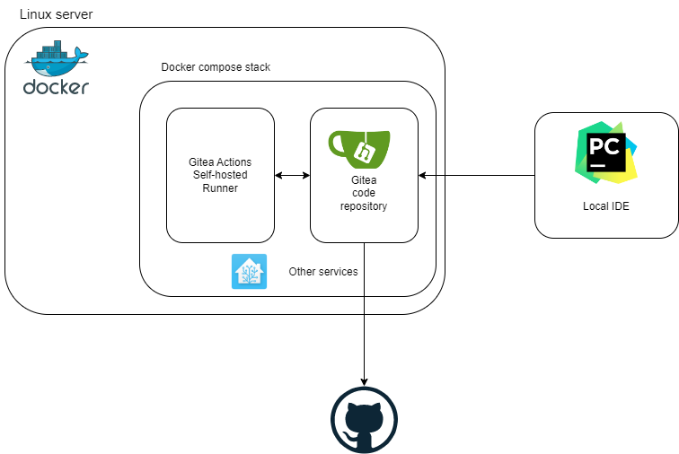

# Docker compose CI/CD
## Features
- Automatically pull changes in your repo to your server.
- Perform `docker compose up` to deploy any new services.
- Restart services if configuration files changed.
- (soon?) scheduled backups (commits) for tracked files with external changes.

## Introduction
While on this self-hosting journey, I've not found any simple solutions that I liked for automatically deploying a docker compose
stack to a single machine. I've played with git hooks and didn't want to go for Github actions (have to expose network). But now with the 
new release of [Gitea Actions](https://blog.gitea.io/2022/12/feature-preview-gitea-actions/), there is another option to self-host a simple 
CI/CD workflow! Nice simple (and Github Actions compatible) workflows, and you can easily store all your 
environment variables in the Gitea repo secrets.

Changes normally come from one of two scenarios:
1) You make changes to your `docker-compose.yml` or something like home assistant's `configuration.yml` in your local IDE.
2) You update something (config) through the UI of a service (say node-red `flows.json`), 
that you want backed up to your repo.

For scenario 1, you can simply make your changes in your comfy local IDE, push them to Gitea and the `deploy.yaml` 
will pull the changes to your server, set environment variables based on your Gitea repo's secrets and update your compose stack.
After deploying your new services, it will also check which files were changed in the last commit, if these file paths contain
names of services you defined, those services will be restarted such that your new config can be picked up! Note: This assumes
the volumes for these services have the same name as the services themselves. E.g. Home assistant is called `homeassistant` in
your docker compose stack and the volume is mapped to a directory also named `homeassistant`.

```yaml
version: "3"
name: home_server
services:
  homeassistant:
    volumes:
      - ${REPO_DIR}/homeassistant:/config
```
For scenario 2, once [this PR in Gitea](https://github.com/go-gitea/gitea/pull/22751) is merged, we can use `backup.yaml`
to schedule a workflow that will push your changes from the server to the repo.
Bonus: From Gitea you can set up a mirror to Github, so that you have extra peace of mind.




## Setup
The following steps are to be executed on the same server the docker compose stack is meant to run on.

1) Use `docker compose up -d gitea` to start Gitea
2) browse to the new Gitea instance and go through initial setup.
3) Since Gitea Actions are still in preview: Enable actions in Gitea's `app.ini` ([see link](https://blog.gitea.io/2022/12/feature-preview-gitea-actions/)) 
and restart Gitea.
```
    # custom/conf/app.ini
    [actions]
    ENABLED = true
```
4) Create a new repo in Gitea. Note: Name the base branch `main` or update the workflows accordingly.
5) Go to the repo's setting in Gitea, check the box: 'Enable Repository Actions' and save.
6) Go to Site Administration -> Runners -> Create new runner and get a runner registration token. 
7) Replace the `${RUNNER_TOKEN}` in `docker-compose.yml` or set it as an environment variable.
8) Run `docker compose up -d gitea_act` to start the actions runner.
9) Add all your environment variables for your other docker compose services to the secrets in the Gitea repo,
using the `SERVER_ENV_PROD` secret name.

Optional:  
10) Set Github (or other) as mirror for Gitea repo.

## Usage
In your development environment, set Gitea as the remote for your repo.
Commit and push your work, add your other services to the `docker-compose.yml` and watch the Gitea Actions do the rest!

## Troubleshooting
- make sure all the volumes in your `docker-compose.yml` have absolute paths, otherwise docker will try to mount
from the filesystem of the Actions Runner container instead of the host.

## TODO / IDEAS
- [x] Simplify by not using SSH between containers, but gitea volume in the runner instead
- [ ] Could maybe try and get a runner token from Gitea by itself?
- [ ] Test the schedule workflow once its released.
- [x] Don't (try to) re-register runner on every build
- [x] Automatically restart services in the workflow if files in their folders have changed.
- [x] Reduce image size
- [x] Add image to Dockerhub
